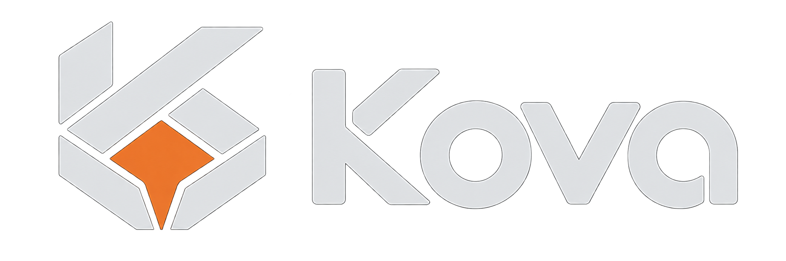

<p align="center">
  
</p>

# Kova Linux

Kova is a minimal, Arch-based Linux live environment with a Rust-friendly command-line toolset. It uses the official Archiso `releng` profile as its foundation and adds its own shell, editor configuration, and system defaults.

> **Status:** Experimental. ISOs are built and boot-tested in QEMU on GitHub Actions; physical hardware and UEFI boot are not yet covered.

## Included

- **Arch Linux** — rolling-release packages, `pacman`, systemd, and the standard Archiso boot environment
- **Fish + Tide** — Fish as the interactive shell, with Tide v6 included in the image
- **Neovim** — default editor, configured from [dme86/neovim](https://github.com/dme86/neovim)
- **Rust CLI tools** — `eza`, `bat`, `fd`, `ripgrep`, `bottom`, `dust`, `procs`, `dysk`, `sd`, `uutils-coreutils`, and `zoxide`
- **Development tools** — `git`, `fzf`, `lazygit`, `tmux`, `npm`, `go`, `tree-sitter-cli`, `unzip`, and build tools
- **Networking** — NetworkManager, inherited from Archiso

## Branding and command-line defaults

The live system identifies as Kova Linux via `/etc/os-release` (`ID=kova`, `ID_LIKE=arch`) and uses Kova-branded BIOS/UEFI boot entries and login text. The upstream Arch kernel, packaging, and repository provenance are retained.

Interactive Fish sessions prefer `eza` for `ls`, `bat` for `cat`, `dust` for `du`, `procs` for `ps`, `dysk` for `df`, and uutils implementations of `cp`, `mv`, `rm`, `mkdir`, `touch`, `sort`, and `wc`. The `dust`, `procs` and `dysk` aliases deliberately use modern syntax rather than emulating all GNU/procps flags. These are Fish aliases, not replacements for executables in `/usr/bin`. System services and non-interactive scripts retain the original commands to preserve compatibility.

`grep`, `find`, and `xargs` are Rust binaries from pinned uutils releases, placed in `/usr/local/bin` and checked by SHA256 before inclusion. They are the **default commands across shells**, not merely Fish aliases. Pacman-owned GNU counterparts remain under `/usr/bin` for compatibility while we work toward Rust replacement packages. `rg` and `fd` remain available under their own names for their modern search behavior.

## Kova Rust tools: Installer and News

Kova's Cargo workspace contains two internal Rust crates and one `kova` executable.

**Installer:** `kova install` previews an installation; `kova install --list-disks` inspects disks; `kova install --dry-run --demo` is a synthetic preview. `kova install --apply` actually wipes the selected disk and installs GPT/UEFI, Btrfs/ZSTD, Snapper + snap-pac, systemd-boot, Fish, greetd and Anvil. It requires a real interactive terminal, a separate `ERASE /dev/...` confirmation and user password entered without echo. The backend re-verifies device identity and refuses mounted or removable targets. **WARNING: this mode irreversibly wipes the selected disk and has not yet been certified by a complete installed-system QEMU/OVMF boot test. Do not try it on valuable physical disks.** No dual boot, LUKS2 or automatic rollback yet.

**News:** `kova news` matches cached Arch Linux RSS articles against installed Pacman packages. `kova news read N` acknowledges an article, `kova news --all` shows everything, and `kova news --summary` is displayed at Fish login without network access. A systemd timer refreshes the RSS cache every six hours. Package matching is heuristic: important upstream notices may not mention installed package names, so `--all` remains useful.

## Anvil Wayland desktop and wallpaper synchronization

The default session is [Anvil](https://github.com/dme86/anvil), launched after login with `greetd` and `tuigreet`. The ISO includes pinned, SHA256-verified Anvil v3.0.1 (an all-features release with layer-shell/XWayland); a weekly systemd timer downloads newer **GitHub Releases**, checks their SHA256 file and installs the new binary for the next login.

The [wallpapers](https://github.com/dme86/.wallpapers) are shallow-cloned into the live image for offline first login and copied to installed machines. A daily systemd timer updates the root-owned repository. Anvil's default config under `/etc/skel` starts `swaybg` with one random image at each login; newly created users inherit the same config. Kova deliberately does not include `feh`: `swaybg` handles wallpapers natively on Wayland.

Anvil DRM/KMS, the greetd session and the destructive installer are still experimental and need hardware and disposable-VM integration testing before a public release.

## Kova default typography and terminal

**Alacritty** is Kova's default Wayland terminal, launched by Anvil's
Super+Return binding, with a minimal dark Kova theme under
`/etc/skel/.config/alacritty/alacritty.toml`. It is written in Rust,
GPU-accelerated and replaces the former `foot` default.

The default font is **JetBrains Mono** with **Nerd Fonts Symbols Mono** as
fallback (both provided by official Arch packages). Fontconfig sets the
system's `monospace` alias accordingly, so terminal prompts and future
status-bar glyphs render consistently. **Adwaita icons** supply the image
icons used by mako for sound and brightness notifications. New user accounts
inherit Alacritty and Mako config via `/etc/skel`.

Kova now pins **Anvil v3.0.1** and enables native XF86 volume/brightness
shortcuts mapped to `kova-osd` in the default Anvil configuration.

## Kova notifications and media controls

Kova uses **mako** (Wayland layer-shell) for notifications and **libnotify**
for the standard `notify-send` command. It works as expected:

```sh
notify-send "Audio Muted"
kova-osd volume up
kova-osd volume down
kova-osd volume mute
kova-osd brightness up
kova-osd brightness down
```

Audio uses PipeWire/WirePlumber (`wpctl`); hardware backlight changes use
`brightnessctl`. The `kova-osd` helper displays a brief top-right
notification with a progress indicator and replaces its previous popup when
buttons are pressed repeatedly. The dark themed config lives in
`/etc/skel/.config/mako/config` and is inherited by new accounts. Anvil
starts mako automatically on login.

**Hardware volume/brightness keybindings are enabled by default.** Kova uses
Anvil v3.0.1 with its new `[media]` mappings to `kova-osd`. Physical
hardware-key behavior still needs on-device validation.
See [the roadmap](docs/roadmap.md) for follow-up testing.

**Planned:** Anvil releases should become an ordinary versioned, signed
Pacman package so `pacman -Syu` can notify users and install updates,
replacing the interim GitHub-release timer. See the roadmap for the durable
repository and migration plan.

## Automatic pacman mirrors

Kova includes [rate-mirrors](https://github.com/westandskif/rate-mirrors), a Rust utility from Arch's official `extra` repository. A systemd timer schedules a first refresh after boot and a weekly refresh, with a 7-day timestamp preventing redundant benchmarks. Only currently synchronized HTTPS mirrors are considered. The new mirrorlist is checked before it atomically replaces the previous version. The last list is backed up at `/etc/pacman.d/mirrorlist.kova-previous`; if mirror ranking fails, the current list stays intact.

Run `sudo systemctl start kova-mirrors.service` for a scheduled refresh, or `sudo KOVA_MIRRORS_FORCE=1 /usr/local/lib/kova/update-mirrors` to force a refresh. The preinstalled mirrorlist remains the fallback when offline. The installer will inherit the ranking and enable the same timer after installation.

The upstream `rate-mirrors` license is **CC BY-NC-SA 3.0**; review its distribution/commercial-use restrictions before public releases.

## Live environment

The live system uses the hostname `kova` and automatically logs in as `kova` on `tty1`, using Fish. The account is created during boot, with its password locked and passwordless `sudo` enabled for the live session.

These permissions apply **only to the disposable live environment**. A persistent installation requires its own user provisioning and authentication policy.

Tide is included in the image under `/etc/fish/` and can be customized with `tide configure`. A Nerd Font is recommended for full symbol support but is not bundled.

## Neovim

The build imports [dme86/neovim](https://github.com/dme86/neovim) into `/etc/skel/.config/nvim`. The `kova` user inherits that configuration on first boot. The upstream commit is recorded in `.kova-source-commit`.

The configuration is available offline, but `lazy.nvim`, Neovim plugins, Mason language servers, and Treesitter parsers are **not bundled**. Their initial installation may require network access. Without a persistent writable filesystem, installed plugins will not survive a reboot.

By default, the build tracks the `main` branch. `KOVA_NVIM_REF` selects a different branch or tag, and `KOVA_NVIM_REPO` overrides the source repository.

## Builds

Kova ISOs are assembled with `mkarchiso` from the official Archiso `releng` profile and the additions in `config/airootfs/`. The original Arch ISO is not used as a build input.

GitHub Actions runs **checks**, **Rust workspace tests/build**, **ISO build**, and **boot** jobs. Pull requests execute the same safety checks before merging. The build job uploads a `kova-iso` handoff artifact; that upload alone does not certify the ISO as bootable. The boot job downloads it, re-verifies SHA256, then boots Kova in QEMU and performs live-system checks. On `v*` tags, a final release job runs only after boot verification succeeds. Failed boot tests retain serial console logs.

The CI pipeline checks shell syntax, verifies the ISO checksum, then boots the ISO under QEMU and validates its live user, Fish/Tide, Neovim binary, and CLI tools. GitHub Release publication only occurs after the boot test passes. The `kova-qemu-logs` artifact preserves serial-console output and QEMU diagnostics for debugging failures. GitHub-hosted nested virtualization is experimental; the QEMU runner falls back to TCG if KVM is unavailable.

### Local build

An Arch Linux host with root access is required:

```sh
sudo pacman -Syu --needed archiso curl git
sudo bash scripts/install-tide.sh config/airootfs
sudo bash scripts/install-neovim-config.sh
sudo bash scripts/install-rust-search.sh config/airootfs
sudo bash scripts/install-anvil.sh config/airootfs
sudo bash scripts/install-wallpapers.sh config/airootfs
cargo build --locked --release -p kova-cli
sudo install -Dm755 target/release/kova config/airootfs/usr/local/bin/kova
sudo install -Dm755 scripts/install-system.sh config/airootfs/usr/local/lib/kova/install-system
sudo bash scripts/build.sh
```

The ISO and checksum are written to `out/`.

Tide and the Neovim configuration are fetched during the build. The Tide install script modifies `config/airootfs/etc/fish/`; for an audited release, dependencies should be pinned to immutable commits and verified with checksums. GitHub-hosted runners may also require additional disk space for the Archiso build.

## Boot testing

Archiso includes `run_archiso` for testing images with QEMU:

```sh
sudo pacman -S --needed qemu-desktop edk2-ovmf
run_archiso -i out/kova-*.iso
```

For automated serial-console testing with QEMU installed:

```sh
bash scripts/test-iso.sh
```

The smoke-test service starts only in a virtual machine with `/dev/ttyS0`. It verifies the live-user systemd service and the tty1 autologin configuration, and runs commands as the `kova` user via `runuser`. This does **not** simulate an interactive console login or an SSH connection. It reports `KOVA_CI_PASS` or `KOVA_CI_FAIL` over the serial port. CI currently covers BIOS boot; UEFI, the graphical environment and a persistent installation require separate tests.

## Installer roadmap

Kova's planned opinionated installer uses GPT, a 1 GiB FAT32 ESP, and a Btrfs root filesystem with ZSTD compression. The `@`, `@home`, `@snapshots`, and `@var_log` subvolumes separate OS state, home data, snapshot history, and logs. Snapper and `snap-pac` provide snapshots and snapshots around pacman operations. See [the installer architecture](docs/installer.md) for the layout, initialization sequence and limitations.

**The experimental installer now has a destructive --apply mode, but full QEMU install/boot verification remains outstanding.** The first install path will target an empty dedicated disk. A future dual-boot mode will use already unallocated space and preserve Windows/other OS partitions; see [installer architecture](docs/installer.md) for EFI, BitLocker and rollback constraints. Partitioning and rollback require disposable-VM integration tests before real hardware.

## Kernel updates

Installed Kova systems will continue to receive the signed Arch Linux `linux` kernel package and kernel-module updates through `pacman -Syu`. Kova-branded login and boot menus do not require a custom kernel or GitHub Actions artifact distribution. The upstream `-arch1` kernel version remains visible.

## Upstream

Kova is an Arch Linux derivative, not an independent distribution. It uses Arch packages, repositories, and the official [Archiso](https://github.com/archlinux/archiso) tooling.
